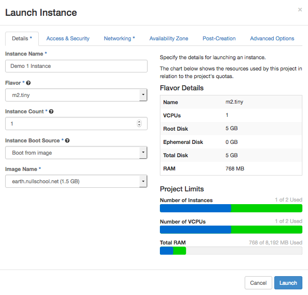

## Demo 1 - An D3-based Interactive Weather Visualization

Today you'll bring online a web server server hosting a visualization of planet-wide wind speeds, based on the D3 JavaScript library. It was created by Cameron Beccario, and the source is at https://github.com/cambecc/earth

Let's go!

1. Login to https://dashboard.rc.nectar.org.au/ using your university account. If you haven't used Nectar before, you'll have to agree to the conditons and you'll be allocated a trial project, perfect for this demo.

2. First, navigate to 'Access & Security' (https://dashboard.rc.nectar.org.au/project/access_and_security/), and click 'Create Key Pair'. Give it a name, and you'll then download the private half of the keypair (a file ending in .pem). Keep this file safe, anyone with access to it can control your instances.

3. Navigate to 'Instances' (https://dashboard.rc.nectar.org.au/project/instances/) and click 'Launch Instance'.

3. Enter the following options on the 'Detail' tab (the 'Image Name' will be under the public section).

4. Under the 'Access & Security' tab:

    * Make sure your new key pair is selected
    * Enable the 'default', 'http', and 'ssh' security groups.
    
5. Click on 'Launch'.

6. Your instance will now be created. It will take a couple minutes to come online, when it does you should see an IP address listed in your list of instances (https://dashboard.rc.nectar.org.au/project/instances/).

7. Enter this IP address into your browser to visit your new web host.

# Bonus Task

The image has weather data baked in from way back in 2004. See if you can login to your instance via SSH (and the keypair you created), and download some new weather data.

Here are some resources to get you started.

[Nectar: Accessing Instances](https://support.ehelp.edu.au/support/solutions/articles/6000055446-accessing-instances)

'Getting Weather Data' section at https://github.com/cambecc/earth (the repository is located in the /home/user/ubuntu/earth directory on your instance)

