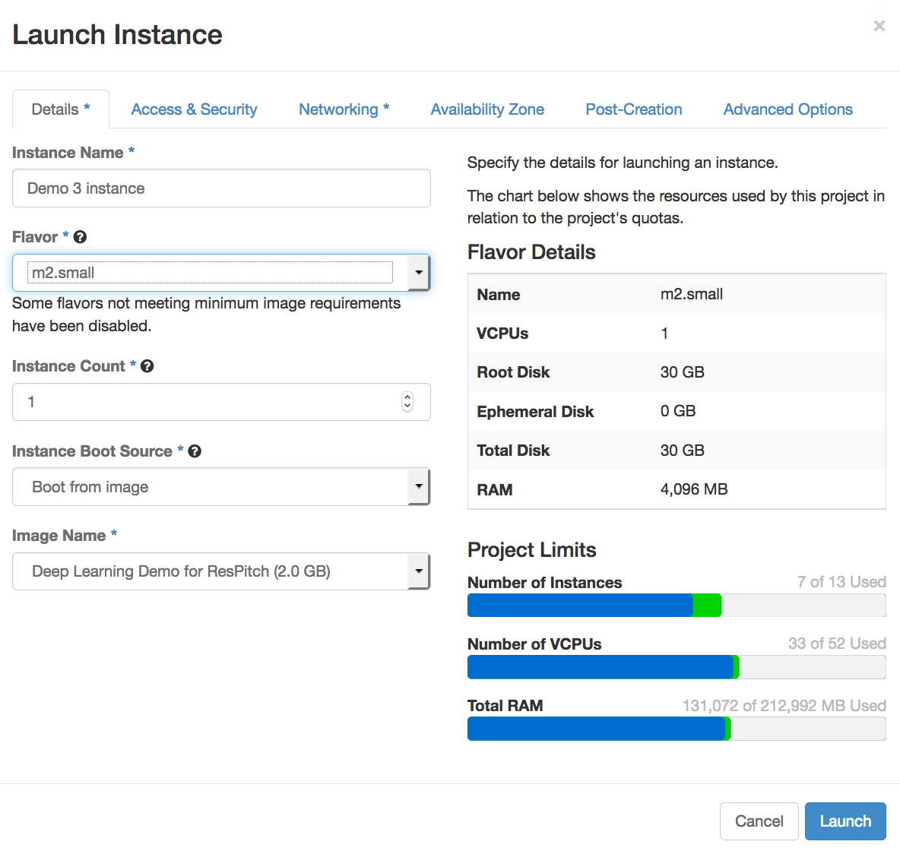

## Demo 3 - Object Recognition using Artificial Intelligence

Today we'll bring online a web application that can take a picture of an object with your webcam, and then tell you what it is with the magic of deep learning!

Let's go!

1. Login to https://dashboard.rc.nectar.org.au/ using your university account. If you haven't used Nectar before, you'll have to agree to the conditons and you'll be allocated a trial project, perfect for this demo.

2. First, navigate to 'Access & Security' (https://dashboard.rc.nectar.org.au/project/access_and_security/), go to the 'Key Pairs' tab, and click 'Create Key Pair'. Give it a name, and you'll then download the private half of the keypair (a file ending in .pem). Keep this file safe, anyone with access to it can control your instances.
3. Navigate to 'Instances' (https://dashboard.rc.nectar.org.au/project/instances/) and click 'Launch Instance'.

3. Enter the following options on the 'Detail' tab (the 'Image Name' will be under the public section). Note that you'll need to use the `m2.small` flavor to make sure you have enough disk space.

    

4. Under the 'Access & Security' tab:

    * Make sure your new key pair is selected
    * Enable the 'default', 'http', and 'ssh' security groups.
    * If the 'http' and 'ssh' security groups aren't listed, you'll have to create them:
        * Navigate to 'Access & Security' again (https://dashboard.rc.nectar.org.au/project/access_and_security/), and click on the 'Security Groups' tab.
        * Click the 'Create Security Group', and name it 'ssh'.
        * Click on the 'Manage Rules' button of your new Security Group, and then 'Add Rule'.
        * Under the 'Rule' dropdown menu, select the 'SSH' option. Leave the other settings at their defaults, and click 'Add'.
        * Repeat the above to create a 'http' Security Group.
        
    
5. Click on 'Launch'. 

6. Your instance will now be created. It will take a couple minutes to come online, when it does you should see an IP address listed in your list of instances (https://dashboard.rc.nectar.org.au/project/instances/).

7. Enter this IP address into your browser to visit your new web host. It might take a few minutes to work as your instance finishes booting. Shout out if you get stuck!

8. Once you're down tinkering, either shut down or terminate your instance (the latter is permanent). Keep in mind that if you don't terminate your instance, it will consume your trial allocation after 3 months.

# Bonus Task

We only show the top five predictions for each picture. By the time you get to the fifth it's pretty much a wild speculative (but often hilarious) guess. What the hell, let's show the top ten results instead, see if you can login to the instance via SSH and hack my code to achieve this. You'll need to modify the file `/home/ubuntu/inception/web.py' and restart the web server (restarting the entire instance will work).

Here are some resources to get you started.

* Nectar: [Accessing Instances](https://support.ehelp.edu.au/support/solutions/articles/6000055446-accessing-instances)
* The relevant [TensorFlow docs](https://www.tensorflow.org/versions/r0.12/tutorials/image_recognition/index.html). 

