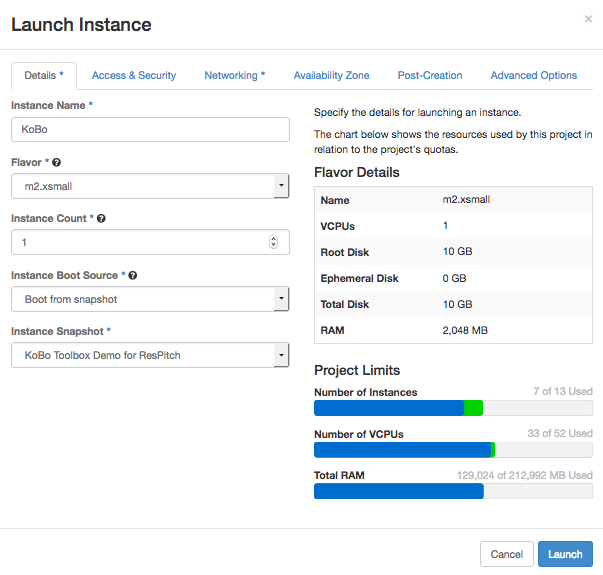

## Demo 4 - Collect Survey Data with KoBo Toolbox

Today we'll bring online a web application called KoBo Toolbox which allows you to design and deploy forms for collecting data. 

You can sign up for KoBo Toolbox on a shared server, but we'll be bringing online our own instance; handy if your data is sensitive and must be stored in Australia, or if you wish to make modifications (it's open source!)

Let's go!

1. Login to https://dashboard.rc.nectar.org.au/ using your university account. If you haven't used Nectar before, you'll have to agree to the conditons and you'll be allocated a trial project, perfect for this demo.

2. First, navigate to 'Access & Security' (https://dashboard.rc.nectar.org.au/project/access_and_security/), go to the 'Key Pairs' tab, and click 'Create Key Pair'. Give it a name, and you'll then download the private half of the keypair (a file ending in .pem). Keep this file safe, anyone with access to it can control your instances.

3. Navigate to 'Instances' (https://dashboard.rc.nectar.org.au/project/instances/) and click 'Launch Instance'.

3. Enter the following options on the 'Detail' tab (the 'Image Name' will be under the public section). Note that you'll need to use the `m2.xsmall` flavor to make sure you have enough disk space.

    

4. Under the 'Access & Security' tab:

    * Make sure your new key pair is selected
    * Enable the 'default', 'http', and 'ssh' security groups.
    * If the 'http' and 'ssh' security groups aren't listed, you'll have to create them:
        * Navigate to 'Access & Security' again (https://dashboard.rc.nectar.org.au/project/access_and_security/), and click on the 'Security Groups' tab.
        * Click the 'Create Security Group', and name it 'ssh'.
        * Click on the 'Manage Rules' button of your new Security Group, and then 'Add Rule'.
        * Under the 'Rule' dropdown menu, select the 'SSH' option. Leave the other settings at their defaults, and click 'Add'.
        * Repeat the above to create a 'http' Security Group.
        
    
5. Click on 'Launch'. 

6. Your instance will now be created. It will take a couple minutes to come online, when it does you should see an IP address listed in your list of instances (https://dashboard.rc.nectar.org.au/project/instances/).

7. Enter this IP address into your browser to visit your new web host. It'll take a few minutes to finish starting up, and you might get some error messages until it does. Shout out if you get stuck!

8. Log in to Kobo Toolbox using the default account, username: admin, password: password (obviously be a little more security-conscious when running this with real data!)

8. Once you're done tinkering, either shut down or terminate your instance (the latter is permanent). Keep in mind that if you don't terminate your instance, it will consume your trial allocation after 3 months.

# Bonus Task

You might notice that you can create forms, but not view the deployed version, since they are hosted on a different port, i.e. you'll end up at somewhere like http://[IP ADDRESS]:8005

See if you can add the port 8005 for incoming connections to the http security group.

Here are some resources to get you started.

* Nectar: [Creating Security Groups](http://training.nectar.org.au/package07/sections/appendices.html)

